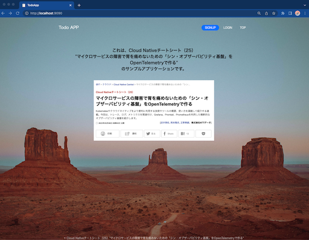
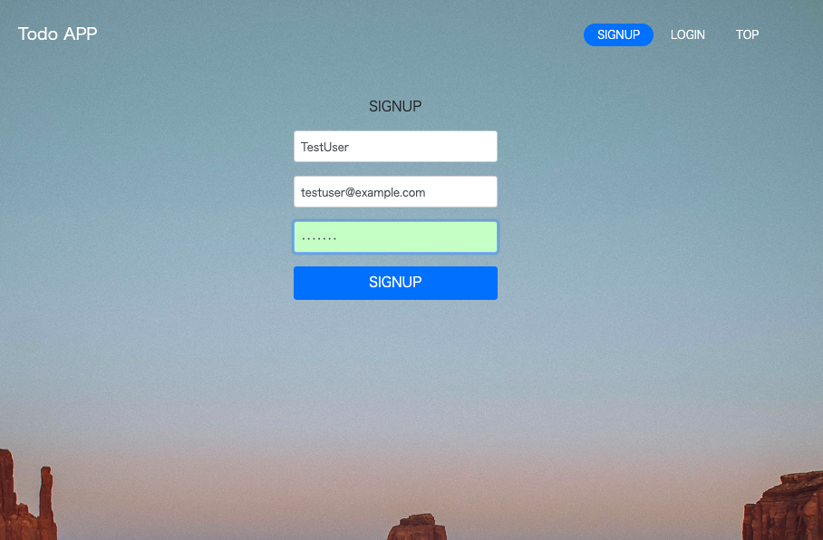
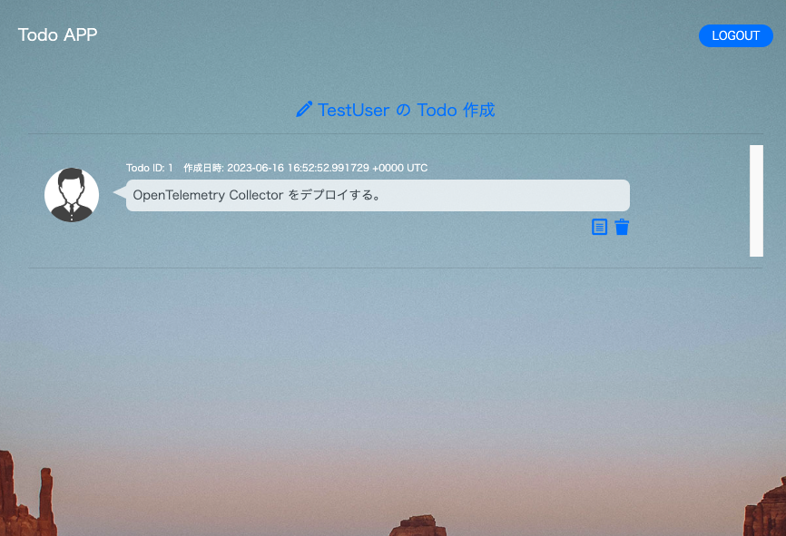

## TodoBFF
サンプルアプリケーション TodoBFF のソースコードです。
本編：https://atmarkit.itmedia.co.jp/ait/articles/2303/07/news009.html

## 接続方法
本編に沿ってサンプルアプリケーションをデプロイ後、以下のコマンドで Pod にポートフォワードしてください。
```sh
$ k port-forward svc/todobff 9090:80 -ntodo
Forwarding from 127.0.0.1:9090 -> 8080
Forwarding from [::1]:9090 -> 8080
```
ブラウザで、「localhost:9090」に接続することでサンプルアプリケーションにアクセスすることができます。

## サンプルアプリケーションの使い方
サンプルアプリケーションでは、ユーザの作成やログイン、Todo の作成 / 削除 / 変更 など簡単な Todo リスト機能が実装されております。

① Top 画面

<center></center>

② ユーザー登録画面

例えば、以下のようにユーザーを登録してください。
- ユーザー名 ```TestUser```
- メールアドレス: ```testuser@example.com```
- パスワード:```test123``` 

※ ```SIGNUP``` 押下後画面が切り替わらない場合は、リフレッシュしてください。
<center></center>

③ Todo 一覧画面

ユーザー登録後、作成したユーザーでログインした状態で、Todo 一覧画面に遷移します。

この画面で、Todoの 作成や、Todoの 更新、Todo の削除を行うことができます。

<center></center>

④ ログアウト

右上の ```LOGOUT``` ボタンを押下することで、TOP 画面に戻ります。

## 補足情報
- TodoAPI：
- UserAPI：